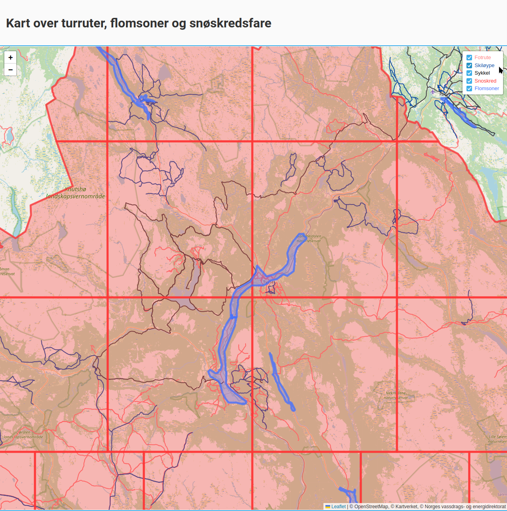
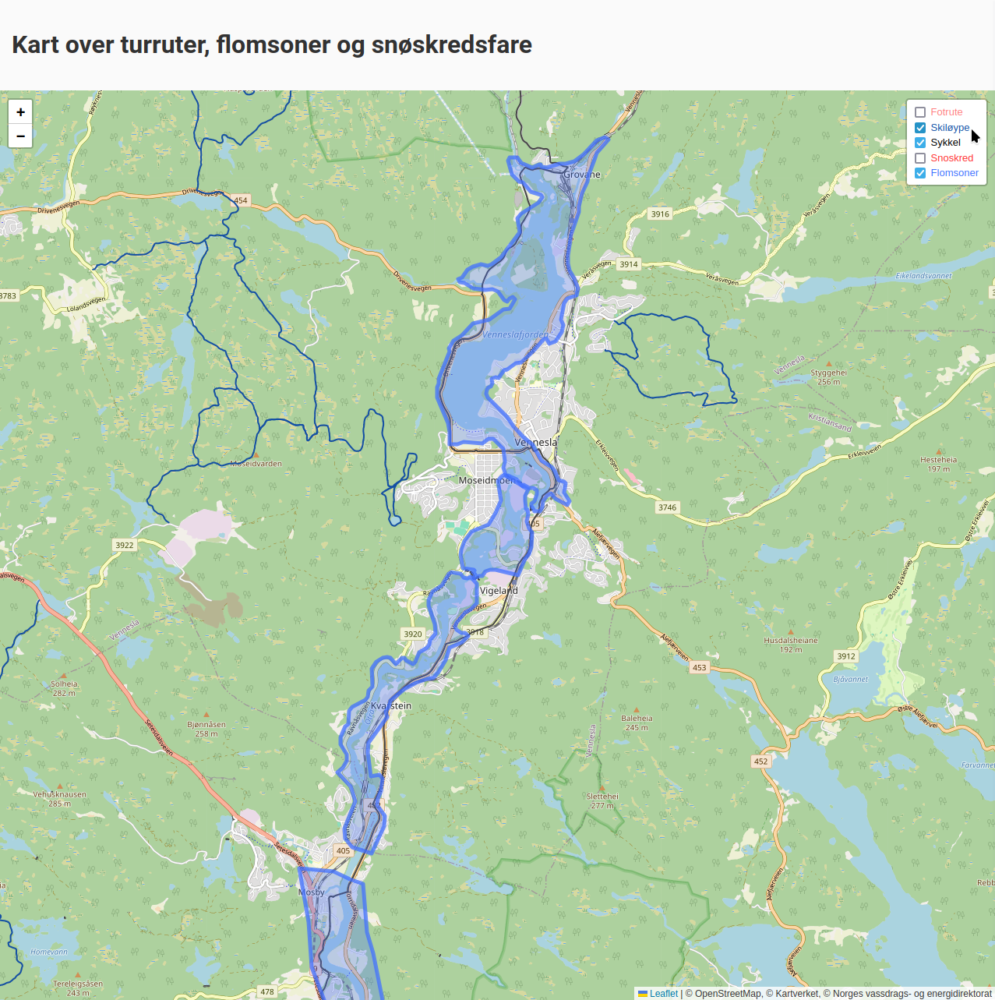
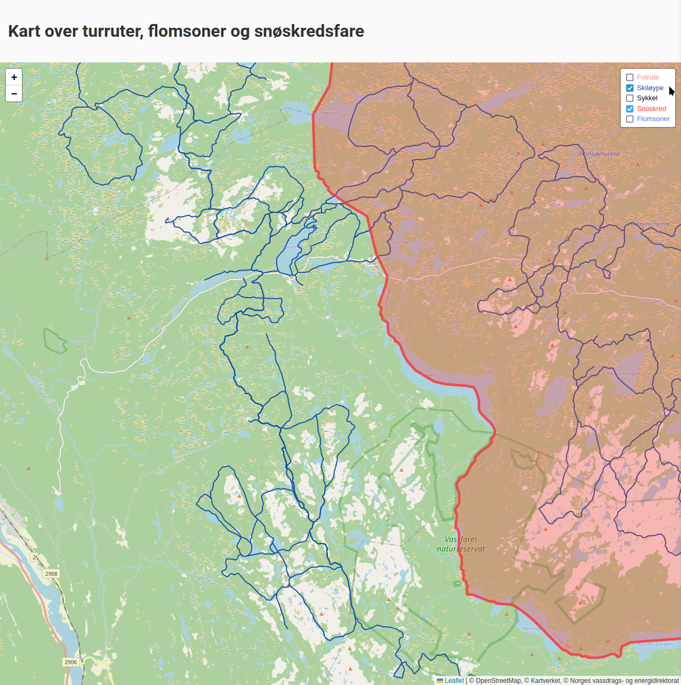
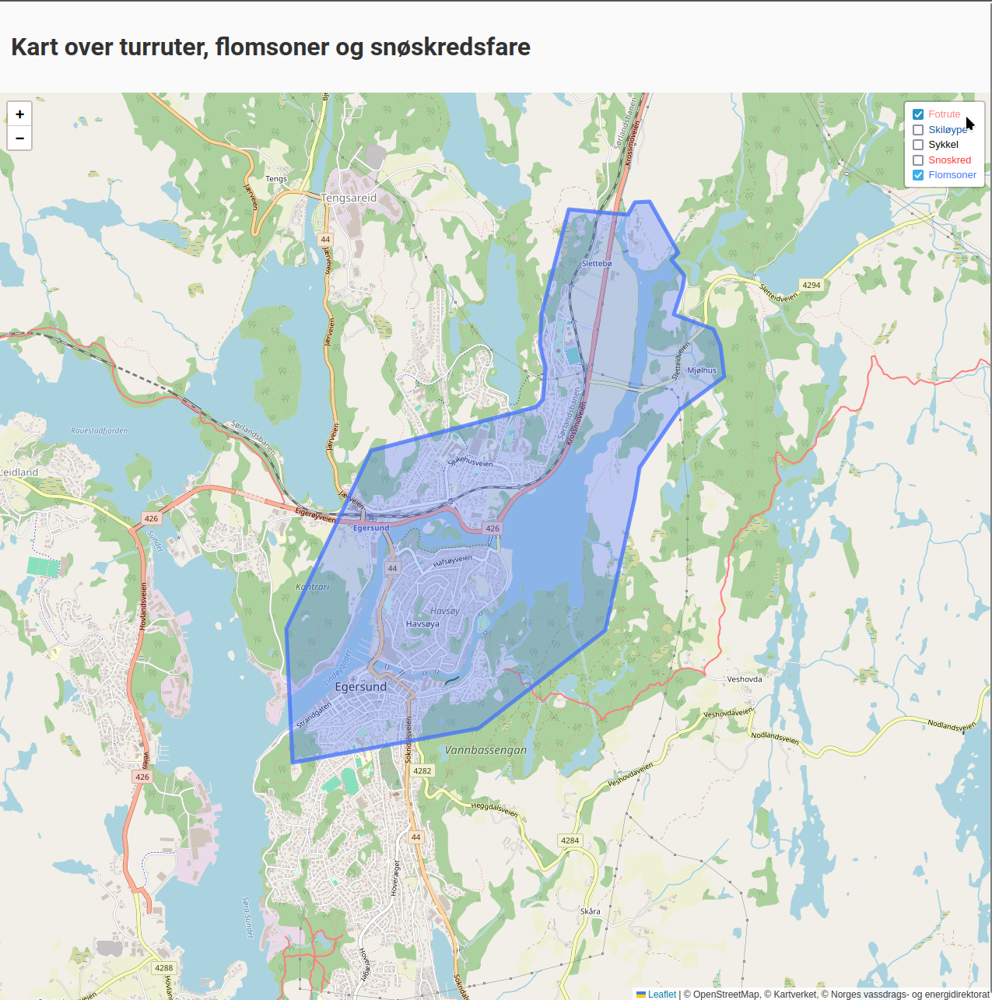
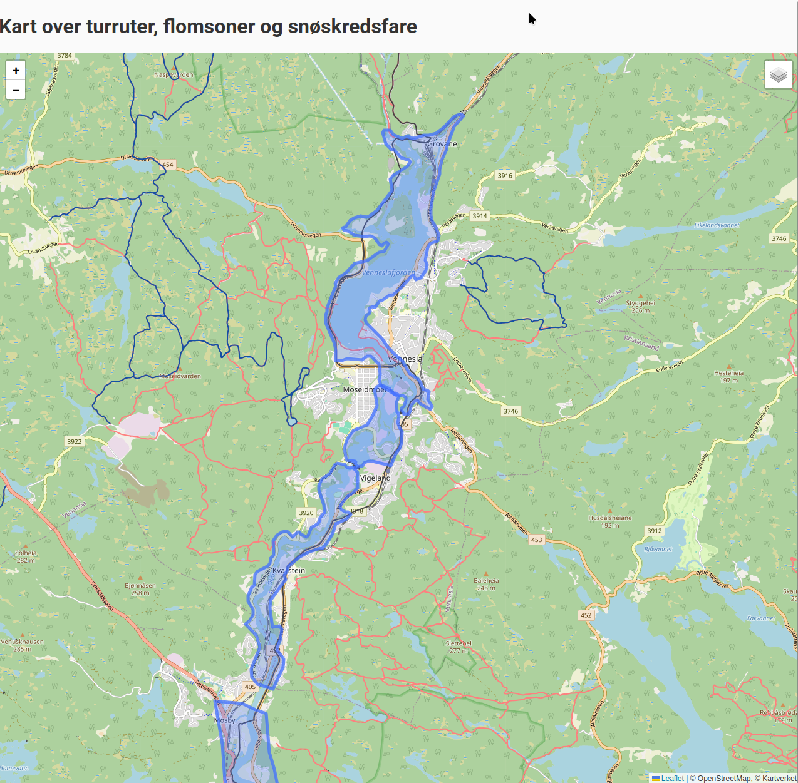
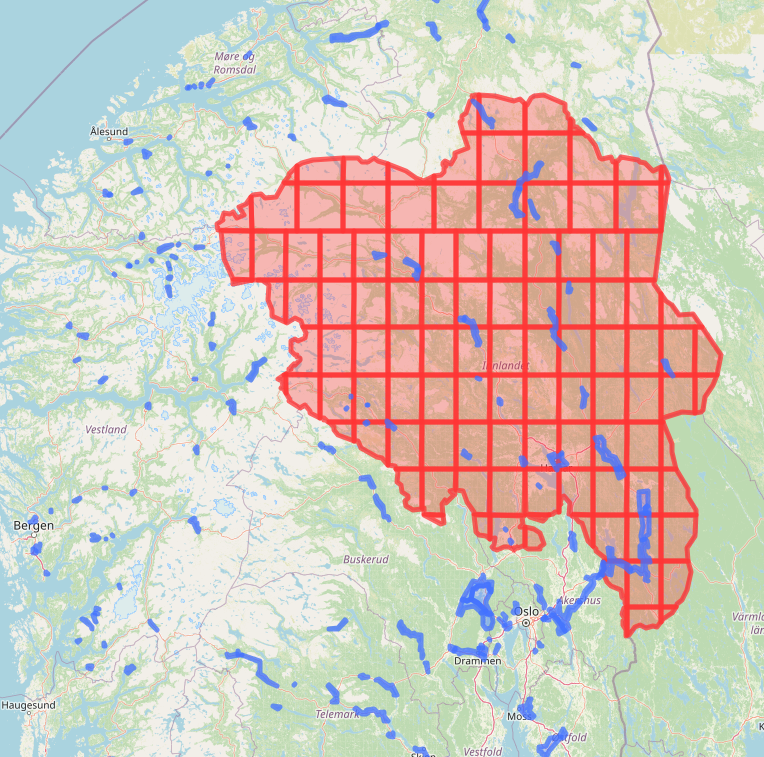
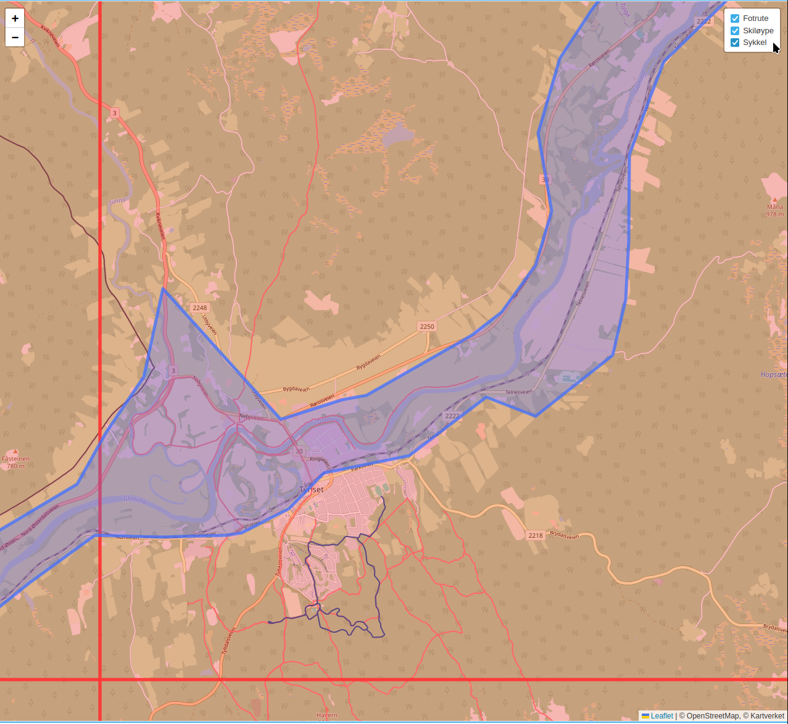

# IS218-Geografisk-IT-utvikling

Problemstilling: Skal du på gåtur, skitur eller sykkeltur i et flomutsatt eller snøskredsutsatt område? 

Datasettene vi har brukt viser hvordan diverse stier og løyper overlapper med skredfare og/eller flomsoner. Dette hjelper brukere å planlegge og tilrettelegge turene sine
I tillegg til å forhindre brukerne i å utsettes for unødvendig farlige situasjoner.

Implementering: 
- Vi henter raster data fra kartverket som et lag oppå OpenStreetMap, deretter legges inn/hentes ut GeoJSON data fra Supabase basert på datasett fra GeoNorge og Norges vassdrags- og energidirektorat. 

Verktøy: 
- Leaflet.js
- Supabase
- TypeScript, HTML, GeoJSON
- bun.sh, Vite

Datasett:
- OpenStreetMap
- Turrutebasen (Fotrute, Sykkelrute, Skiløype)
    -  (GeoNorge, Kartverket) (WMS)
- Flomsoner 
    - (GeoNorge, Norges vassdrags- og energidirektorat) (GeoJSON)
- Aktsomhetskart for snøskred 
    - (GeoNorge, Norges vassdrags- og energidirektorat) (GeoJSON)

### Bilder:






### Video:

<video controls src="2025-03-04 22-33-33.mp4" title="Prosjekt"></video>

<!-- 

 -->

Env variables
- VITE_supabaseUrl
- VITE_supabaseKey

# proto-gis

To install dependencies:

```bash
bun install
```

To run:

```bash
bun run dev
```

This project was created using `bun init` in bun v1.2.2. [Bun](https://bun.sh) is a fast all-in-one JavaScript runtime.
